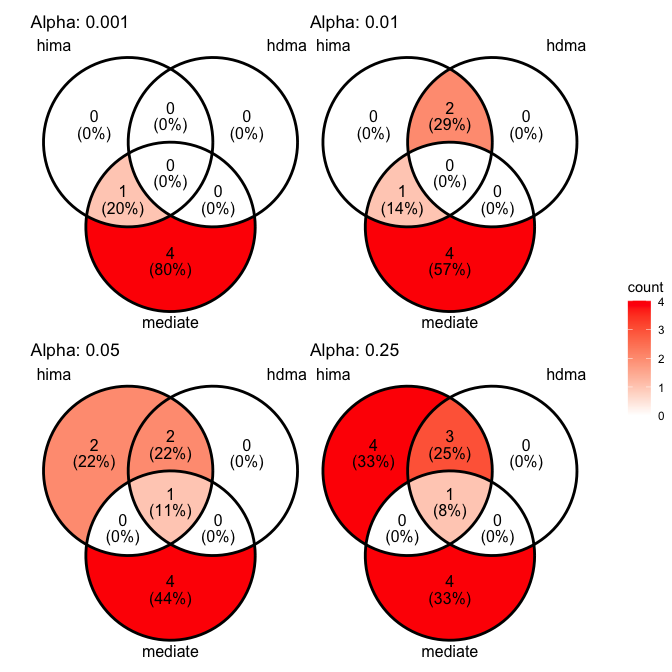
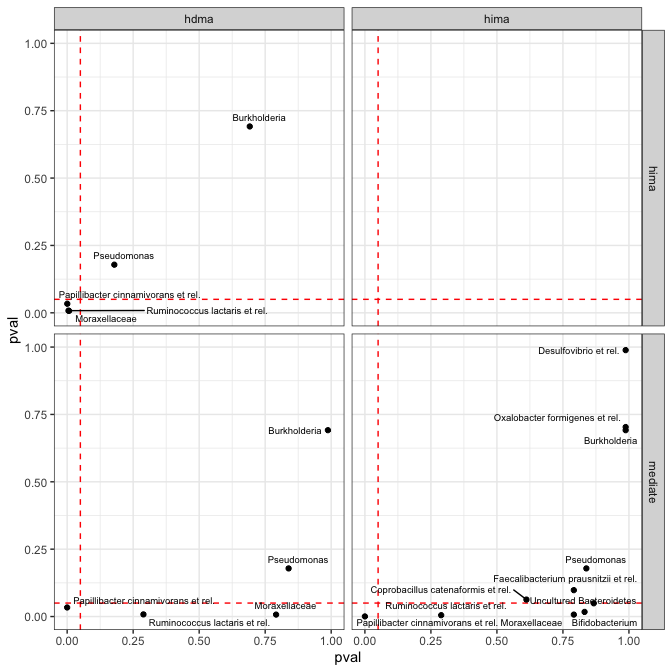

# Comparison of high-dimensional Methods
Giulio Benedetti

``` r
tse <- OKeefeDSData()
```

``` r
tse <- transformAssay(tse,
                      method = "relabundance")

tse <- estimateDiversity(tse,
                         index = "shannon",
                         assay.type = "relabundance")
```

``` r
tse <- tse[ , !is.na(tse$bmi_group)]
tse <- tse[ , !is.na(tse$nationality)]

colData(tse)$bmi_group <- as.numeric(tse$bmi_group)
colData(tse)$nationality <- as.numeric(factor(tse$nationality)) - 1

tse <- transformAssay(tse,
                      method = "clr",
                      pseudocount = 1)

tse <- tse[ , tse$timepoint.within.group == 2]
```

``` r
med_res <- mediateAssay(tse,
                        outcome = "bmi_group",
                        treatment = "nationality",
                        assay.type = "clr",
                        boot = TRUE, sims = 100)
```

    [1] "130 left"
    [1] "Current mediator: Actinomycetaceae"
    [1] "129 left"
    [1] "Current mediator: Aerococcus"
    [1] "128 left"
    [1] "Current mediator: Aeromonas"
    [1] "127 left"
    [1] "Current mediator: Akkermansia"
    [1] "126 left"
    [1] "Current mediator: Alcaligenes faecalis et rel."
    [1] "125 left"
    [1] "Current mediator: Allistipes et rel."
    [1] "124 left"
    [1] "Current mediator: Anaerobiospirillum"
    [1] "123 left"
    [1] "Current mediator: Anaerofustis"
    [1] "122 left"
    [1] "Current mediator: Anaerostipes caccae et rel."
    [1] "121 left"
    [1] "Current mediator: Anaerotruncus colihominis et rel."
    [1] "120 left"
    [1] "Current mediator: Anaerovorax odorimutans et rel."
    [1] "119 left"
    [1] "Current mediator: Aneurinibacillus"
    [1] "118 left"
    [1] "Current mediator: Aquabacterium"
    [1] "117 left"
    [1] "Current mediator: Asteroleplasma et rel."
    [1] "116 left"
    [1] "Current mediator: Atopobium"
    [1] "115 left"
    [1] "Current mediator: Bacillus"
    [1] "114 left"
    [1] "Current mediator: Bacteroides fragilis et rel."
    [1] "113 left"
    [1] "Current mediator: Bacteroides intestinalis et rel."
    [1] "112 left"
    [1] "Current mediator: Bacteroides ovatus et rel."
    [1] "111 left"
    [1] "Current mediator: Bacteroides plebeius et rel."
    [1] "110 left"
    [1] "Current mediator: Bacteroides splachnicus et rel."
    [1] "109 left"
    [1] "Current mediator: Bacteroides stercoris et rel."
    [1] "108 left"
    [1] "Current mediator: Bacteroides uniformis et rel."
    [1] "107 left"
    [1] "Current mediator: Bacteroides vulgatus et rel."
    [1] "106 left"
    [1] "Current mediator: Bifidobacterium"
    [1] "105 left"
    [1] "Current mediator: Bilophila et rel."
    [1] "104 left"
    [1] "Current mediator: Brachyspira"
    [1] "103 left"
    [1] "Current mediator: Bryantella formatexigens et rel."
    [1] "102 left"
    [1] "Current mediator: Bulleidia moorei et rel."
    [1] "101 left"
    [1] "Current mediator: Burkholderia"
    [1] "100 left"
    [1] "Current mediator: Butyrivibrio crossotus et rel."
    [1] "99 left"
    [1] "Current mediator: Campylobacter"
    [1] "98 left"
    [1] "Current mediator: Catenibacterium mitsuokai et rel."
    [1] "97 left"
    [1] "Current mediator: Clostridium (sensu stricto)"
    [1] "96 left"
    [1] "Current mediator: Clostridium cellulosi et rel."
    [1] "95 left"
    [1] "Current mediator: Clostridium colinum et rel."
    [1] "94 left"
    [1] "Current mediator: Clostridium difficile et rel."
    [1] "93 left"
    [1] "Current mediator: Clostridium felsineum et rel."
    [1] "92 left"
    [1] "Current mediator: Clostridium leptum et rel."
    [1] "91 left"
    [1] "Current mediator: Clostridium nexile et rel."
    [1] "90 left"
    [1] "Current mediator: Clostridium orbiscindens et rel."
    [1] "89 left"
    [1] "Current mediator: Clostridium ramosum et rel."
    [1] "88 left"
    [1] "Current mediator: Clostridium sphenoides et rel."
    [1] "87 left"
    [1] "Current mediator: Clostridium stercorarium et rel."
    [1] "86 left"
    [1] "Current mediator: Clostridium symbiosum et rel."
    [1] "85 left"
    [1] "Current mediator: Clostridium thermocellum et rel."
    [1] "84 left"
    [1] "Current mediator: Collinsella"
    [1] "83 left"
    [1] "Current mediator: Coprobacillus catenaformis et rel."
    [1] "82 left"
    [1] "Current mediator: Coprococcus eutactus et rel."
    [1] "81 left"
    [1] "Current mediator: Corynebacterium"
    [1] "80 left"
    [1] "Current mediator: Desulfovibrio et rel."
    [1] "79 left"
    [1] "Current mediator: Dialister"
    [1] "78 left"
    [1] "Current mediator: Dorea formicigenerans et rel."
    [1] "77 left"
    [1] "Current mediator: Eggerthella lenta et rel."
    [1] "76 left"
    [1] "Current mediator: Enterobacter aerogenes et rel."
    [1] "75 left"
    [1] "Current mediator: Enterococcus"
    [1] "74 left"
    [1] "Current mediator: Escherichia coli et rel."
    [1] "73 left"
    [1] "Current mediator: Eubacterium biforme et rel."
    [1] "72 left"
    [1] "Current mediator: Eubacterium cylindroides et rel."
    [1] "71 left"
    [1] "Current mediator: Eubacterium hallii et rel."
    [1] "70 left"
    [1] "Current mediator: Eubacterium limosum et rel."
    [1] "69 left"
    [1] "Current mediator: Eubacterium rectale et rel."
    [1] "68 left"
    [1] "Current mediator: Eubacterium siraeum et rel."
    [1] "67 left"
    [1] "Current mediator: Eubacterium ventriosum et rel."
    [1] "66 left"
    [1] "Current mediator: Faecalibacterium prausnitzii et rel."
    [1] "65 left"
    [1] "Current mediator: Fusobacteria"
    [1] "64 left"
    [1] "Current mediator: Gemella"
    [1] "63 left"
    [1] "Current mediator: Granulicatella"
    [1] "62 left"
    [1] "Current mediator: Haemophilus"
    [1] "61 left"
    [1] "Current mediator: Helicobacter"
    [1] "60 left"
    [1] "Current mediator: Klebisiella pneumoniae et rel."
    [1] "59 left"
    [1] "Current mediator: Lachnobacillus bovis et rel."
    [1] "58 left"
    [1] "Current mediator: Lachnospira pectinoschiza et rel."
    [1] "57 left"
    [1] "Current mediator: Lactobacillus catenaformis et rel."
    [1] "56 left"
    [1] "Current mediator: Lactobacillus gasseri et rel."
    [1] "55 left"
    [1] "Current mediator: Lactobacillus plantarum et rel."
    [1] "54 left"
    [1] "Current mediator: Lactobacillus salivarius et rel."
    [1] "53 left"
    [1] "Current mediator: Lactococcus"
    [1] "52 left"
    [1] "Current mediator: Leminorella"
    [1] "51 left"
    [1] "Current mediator: Megamonas hypermegale et rel."
    [1] "50 left"
    [1] "Current mediator: Megasphaera elsdenii et rel."
    [1] "49 left"
    [1] "Current mediator: Methylobacterium"
    [1] "48 left"
    [1] "Current mediator: Micrococcaceae"
    [1] "47 left"
    [1] "Current mediator: Mitsuokella multiacida et rel."
    [1] "46 left"
    [1] "Current mediator: Moraxellaceae"
    [1] "45 left"
    [1] "Current mediator: Novosphingobium"
    [1] "44 left"
    [1] "Current mediator: Oceanospirillum"
    [1] "43 left"
    [1] "Current mediator: Oscillospira guillermondii et rel."
    [1] "42 left"
    [1] "Current mediator: Outgrouping clostridium cluster XIVa"
    [1] "41 left"
    [1] "Current mediator: Oxalobacter formigenes et rel."
    [1] "40 left"
    [1] "Current mediator: Papillibacter cinnamivorans et rel."
    [1] "39 left"
    [1] "Current mediator: Parabacteroides distasonis et rel."
    [1] "38 left"
    [1] "Current mediator: Peptococcus niger et rel."
    [1] "37 left"
    [1] "Current mediator: Peptostreptococcus anaerobius et rel."
    [1] "36 left"
    [1] "Current mediator: Peptostreptococcus micros et rel."
    [1] "35 left"
    [1] "Current mediator: Phascolarctobacterium faecium et rel."
    [1] "34 left"
    [1] "Current mediator: Prevotella melaninogenica et rel."
    [1] "33 left"
    [1] "Current mediator: Prevotella oralis et rel."
    [1] "32 left"
    [1] "Current mediator: Prevotella ruminicola et rel."
    [1] "31 left"
    [1] "Current mediator: Prevotella tannerae et rel."
    [1] "30 left"
    [1] "Current mediator: Propionibacterium"
    [1] "29 left"
    [1] "Current mediator: Proteus et rel."
    [1] "28 left"
    [1] "Current mediator: Pseudomonas"
    [1] "27 left"
    [1] "Current mediator: Roseburia intestinalis et rel."
    [1] "26 left"
    [1] "Current mediator: Ruminococcus bromii et rel."
    [1] "25 left"
    [1] "Current mediator: Ruminococcus callidus et rel."
    [1] "24 left"
    [1] "Current mediator: Ruminococcus gnavus et rel."
    [1] "23 left"
    [1] "Current mediator: Ruminococcus lactaris et rel."
    [1] "22 left"
    [1] "Current mediator: Ruminococcus obeum et rel."
    [1] "21 left"
    [1] "Current mediator: Serratia"
    [1] "20 left"
    [1] "Current mediator: Sporobacter termitidis et rel."
    [1] "19 left"
    [1] "Current mediator: Staphylococcus"
    [1] "18 left"
    [1] "Current mediator: Streptococcus bovis et rel."
    [1] "17 left"
    [1] "Current mediator: Streptococcus intermedius et rel."
    [1] "16 left"
    [1] "Current mediator: Streptococcus mitis et rel."
    [1] "15 left"
    [1] "Current mediator: Subdoligranulum variable at rel."
    [1] "14 left"
    [1] "Current mediator: Sutterella wadsworthia et rel."
    [1] "13 left"
    [1] "Current mediator: Tannerella et rel."
    [1] "12 left"
    [1] "Current mediator: Uncultured Bacteroidetes"
    [1] "11 left"
    [1] "Current mediator: Uncultured Chroococcales"
    [1] "10 left"
    [1] "Current mediator: Uncultured Clostridiales I"
    [1] "9 left"
    [1] "Current mediator: Uncultured Clostridiales II"
    [1] "8 left"
    [1] "Current mediator: Uncultured Mollicutes"
    [1] "7 left"
    [1] "Current mediator: Uncultured Selenomonadaceae"
    [1] "6 left"
    [1] "Current mediator: Veillonella"
    [1] "5 left"
    [1] "Current mediator: Vibrio"
    [1] "4 left"
    [1] "Current mediator: Weissella et rel."
    [1] "3 left"
    [1] "Current mediator: Wissella et rel."
    [1] "2 left"
    [1] "Current mediator: Xanthomonadaceae"
    [1] "1 left"
    [1] "Current mediator: Yersinia et rel."

``` r
hima_res <- mediate_hima(A = tse$nationality,
                         M = t(assay(tse, "clr")),
                         Y = tse$bmi_group)

hdma_res <- mediate_hdma(A = tse$nationality,
                         M = t(assay(tse, "clr")),
                         Y = tse$bmi_group)

bslmm_res <- mediate_bslmm(A = tse$nationality,
                           M = t(assay(tse, "clr")),
                           Y = tse$bmi_group)
```

``` r
med_df <- med_res %>%
  rename(mediator = Mediator) %>%
  full_join(bslmm_res$contributions, by = "mediator") %>%
  full_join(hima_res$contributions, by = "mediator",
            suffix = c("_bslmm", "")) %>%
  full_join(hdma_res$contributions, by = "mediator",
            suffix = c("_hima", "_hdma"))
```

``` r
plot.venn <- function(med_df, cutoff,
                      pval_cols = c("ab_pv_hima",
                                    "ab_pv_hdma",
                                    "ACME_adjpval")) {
  
  lis <- lapply(med_df[ , pval_cols],
                function(col) which(col < cutoff))
  
  names(lis) <- c("hima", "hdma", "mediate")

  p <- ggVennDiagram(lis,
                     label_geom = "text",
                     label_alpha = 1) +
    scale_fill_gradient(low = "white", high = "red") +
    labs(title = paste("Alpha:", cutoff))
  
  return(p)
}
```

``` r
(plot.venn(med_df, 0.001) | plot.venn(med_df, 0.01)) /
  (plot.venn(med_df, 0.05) | plot.venn(med_df, 0.25)) +
  plot_layout(guides = "collect")
```



``` r
get.combos <- function(x) {
  
  pval_combos <- t(combn(m = 2, x[c("mediate", "hima", "hdma")]))
  method_combos <- t(combn(m = 2, c("mediate", "hima", "hdma")))
  
  mat <- cbind(x[["mediator"]], pval_combos, method_combos)
  
  return(mat)
}
```

``` r
comb_df <- med_df %>%
  transmute(mediator,
            mediate = ACME_adjpval,
            hima = ab_pv_hima,
            hdma = ab_pv_hdma) %>%
  apply(1, get.combos, simplify = FALSE) %>%
  do.call(rbind, .) %>%
  as.data.frame() %>%
  drop_na() %>%
  mutate(V2 = as.numeric(V2),
         V3 = as.numeric(V3))

colnames(comb_df) <- c("mediator", "xval", "yval", "xname", "yname")
```

``` r
ggplot(comb_df, aes(x = xval, y = yval)) +
  geom_hline(yintercept = 0.05,
             linetype = "dashed", colour = "red") +
  geom_vline(xintercept = 0.05,
             linetype = "dashed", colour = "red") +
  geom_point() +
  scale_x_continuous(limits = c(0, 1)) +
  scale_y_continuous(limits = c(0, 1)) +
  geom_text_repel(aes(label = mediator), size = 2.5) +
  facet_grid(xname ~ yname) +
  labs(x = "pval", y = "pval") +
  theme_bw()
```


