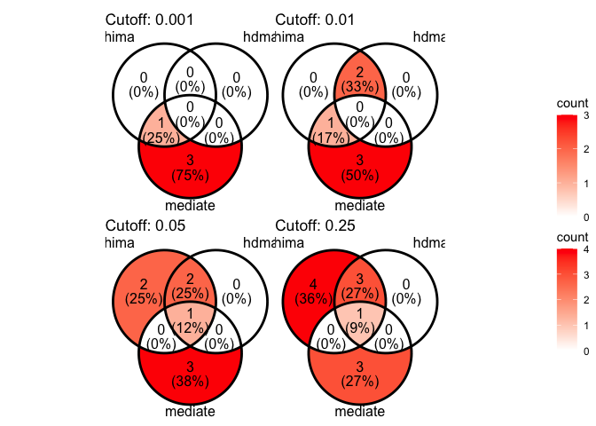
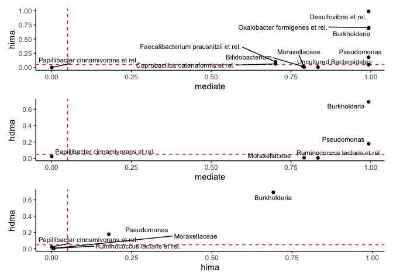

# Comparison of high-dimensional Methods
Giulio Benedetti

``` r
tse <- OKeefeDSData()
```

``` r
tse <- transformAssay(tse,
                      method = "relabundance")

tse <- estimateDiversity(tse,
                         index = "shannon",
                         assay.type = "relabundance")
```

``` r
tse <- tse[ , !is.na(tse$bmi_group)]
tse <- tse[ , !is.na(tse$nationality)]

colData(tse)$bmi_group <- as.numeric(tse$bmi_group)
colData(tse)$nationality <- as.numeric(factor(tse$nationality)) - 1

tse <- transformAssay(tse,
                      method = "clr",
                      pseudocount = 1)

tse <- tse[ , tse$timepoint.within.group == 2]
```

``` r
med_res <- mediateAssay(tse,
                        outcome = "bmi_group",
                        treatment = "nationality",
                        assay.type = "clr",
                        boot = TRUE, sims = 300)
```

    [1] "130 left"
    [1] "Current mediator: Actinomycetaceae"

    Running nonparametric bootstrap

    [1] "129 left"
    [1] "Current mediator: Aerococcus"

    Running nonparametric bootstrap

    [1] "128 left"
    [1] "Current mediator: Aeromonas"

    Running nonparametric bootstrap

    [1] "127 left"
    [1] "Current mediator: Akkermansia"

    Running nonparametric bootstrap

    [1] "126 left"
    [1] "Current mediator: Alcaligenes faecalis et rel."

    Running nonparametric bootstrap

    [1] "125 left"
    [1] "Current mediator: Allistipes et rel."

    Running nonparametric bootstrap

    [1] "124 left"
    [1] "Current mediator: Anaerobiospirillum"

    Running nonparametric bootstrap

    [1] "123 left"
    [1] "Current mediator: Anaerofustis"

    Running nonparametric bootstrap

    [1] "122 left"
    [1] "Current mediator: Anaerostipes caccae et rel."

    Running nonparametric bootstrap

    [1] "121 left"
    [1] "Current mediator: Anaerotruncus colihominis et rel."

    Running nonparametric bootstrap

    [1] "120 left"
    [1] "Current mediator: Anaerovorax odorimutans et rel."

    Running nonparametric bootstrap

    [1] "119 left"
    [1] "Current mediator: Aneurinibacillus"

    Running nonparametric bootstrap

    [1] "118 left"
    [1] "Current mediator: Aquabacterium"

    Running nonparametric bootstrap

    [1] "117 left"
    [1] "Current mediator: Asteroleplasma et rel."

    Running nonparametric bootstrap

    [1] "116 left"
    [1] "Current mediator: Atopobium"

    Running nonparametric bootstrap

    [1] "115 left"
    [1] "Current mediator: Bacillus"

    Running nonparametric bootstrap

    [1] "114 left"
    [1] "Current mediator: Bacteroides fragilis et rel."

    Running nonparametric bootstrap

    [1] "113 left"
    [1] "Current mediator: Bacteroides intestinalis et rel."

    Running nonparametric bootstrap

    [1] "112 left"
    [1] "Current mediator: Bacteroides ovatus et rel."

    Running nonparametric bootstrap

    [1] "111 left"
    [1] "Current mediator: Bacteroides plebeius et rel."

    Running nonparametric bootstrap

    [1] "110 left"
    [1] "Current mediator: Bacteroides splachnicus et rel."

    Running nonparametric bootstrap

    [1] "109 left"
    [1] "Current mediator: Bacteroides stercoris et rel."

    Running nonparametric bootstrap

    [1] "108 left"
    [1] "Current mediator: Bacteroides uniformis et rel."

    Running nonparametric bootstrap

    [1] "107 left"
    [1] "Current mediator: Bacteroides vulgatus et rel."

    Running nonparametric bootstrap

    [1] "106 left"
    [1] "Current mediator: Bifidobacterium"

    Running nonparametric bootstrap

    [1] "105 left"
    [1] "Current mediator: Bilophila et rel."

    Running nonparametric bootstrap

    [1] "104 left"
    [1] "Current mediator: Brachyspira"

    Running nonparametric bootstrap

    [1] "103 left"
    [1] "Current mediator: Bryantella formatexigens et rel."

    Running nonparametric bootstrap

    [1] "102 left"
    [1] "Current mediator: Bulleidia moorei et rel."

    Running nonparametric bootstrap

    [1] "101 left"
    [1] "Current mediator: Burkholderia"

    Running nonparametric bootstrap

    [1] "100 left"
    [1] "Current mediator: Butyrivibrio crossotus et rel."

    Running nonparametric bootstrap

    [1] "99 left"
    [1] "Current mediator: Campylobacter"

    Running nonparametric bootstrap

    [1] "98 left"
    [1] "Current mediator: Catenibacterium mitsuokai et rel."

    Running nonparametric bootstrap

    [1] "97 left"
    [1] "Current mediator: Clostridium (sensu stricto)"

    Running nonparametric bootstrap

    [1] "96 left"
    [1] "Current mediator: Clostridium cellulosi et rel."

    Running nonparametric bootstrap

    [1] "95 left"
    [1] "Current mediator: Clostridium colinum et rel."

    Running nonparametric bootstrap

    [1] "94 left"
    [1] "Current mediator: Clostridium difficile et rel."

    Running nonparametric bootstrap

    [1] "93 left"
    [1] "Current mediator: Clostridium felsineum et rel."

    Running nonparametric bootstrap

    [1] "92 left"
    [1] "Current mediator: Clostridium leptum et rel."

    Running nonparametric bootstrap

    [1] "91 left"
    [1] "Current mediator: Clostridium nexile et rel."

    Running nonparametric bootstrap

    [1] "90 left"
    [1] "Current mediator: Clostridium orbiscindens et rel."

    Running nonparametric bootstrap

    [1] "89 left"
    [1] "Current mediator: Clostridium ramosum et rel."

    Running nonparametric bootstrap

    [1] "88 left"
    [1] "Current mediator: Clostridium sphenoides et rel."

    Running nonparametric bootstrap

    [1] "87 left"
    [1] "Current mediator: Clostridium stercorarium et rel."

    Running nonparametric bootstrap

    [1] "86 left"
    [1] "Current mediator: Clostridium symbiosum et rel."

    Running nonparametric bootstrap

    [1] "85 left"
    [1] "Current mediator: Clostridium thermocellum et rel."

    Running nonparametric bootstrap

    [1] "84 left"
    [1] "Current mediator: Collinsella"

    Running nonparametric bootstrap

    [1] "83 left"
    [1] "Current mediator: Coprobacillus catenaformis et rel."

    Running nonparametric bootstrap

    [1] "82 left"
    [1] "Current mediator: Coprococcus eutactus et rel."

    Running nonparametric bootstrap

    [1] "81 left"
    [1] "Current mediator: Corynebacterium"

    Running nonparametric bootstrap

    [1] "80 left"
    [1] "Current mediator: Desulfovibrio et rel."

    Running nonparametric bootstrap

    [1] "79 left"
    [1] "Current mediator: Dialister"

    Running nonparametric bootstrap

    [1] "78 left"
    [1] "Current mediator: Dorea formicigenerans et rel."

    Running nonparametric bootstrap

    [1] "77 left"
    [1] "Current mediator: Eggerthella lenta et rel."

    Running nonparametric bootstrap

    [1] "76 left"
    [1] "Current mediator: Enterobacter aerogenes et rel."

    Running nonparametric bootstrap

    [1] "75 left"
    [1] "Current mediator: Enterococcus"

    Running nonparametric bootstrap

    [1] "74 left"
    [1] "Current mediator: Escherichia coli et rel."

    Running nonparametric bootstrap

    [1] "73 left"
    [1] "Current mediator: Eubacterium biforme et rel."

    Running nonparametric bootstrap

    [1] "72 left"
    [1] "Current mediator: Eubacterium cylindroides et rel."

    Running nonparametric bootstrap

    [1] "71 left"
    [1] "Current mediator: Eubacterium hallii et rel."

    Running nonparametric bootstrap

    [1] "70 left"
    [1] "Current mediator: Eubacterium limosum et rel."

    Running nonparametric bootstrap

    [1] "69 left"
    [1] "Current mediator: Eubacterium rectale et rel."

    Running nonparametric bootstrap

    [1] "68 left"
    [1] "Current mediator: Eubacterium siraeum et rel."

    Running nonparametric bootstrap

    [1] "67 left"
    [1] "Current mediator: Eubacterium ventriosum et rel."

    Running nonparametric bootstrap

    [1] "66 left"
    [1] "Current mediator: Faecalibacterium prausnitzii et rel."

    Running nonparametric bootstrap

    [1] "65 left"
    [1] "Current mediator: Fusobacteria"

    Running nonparametric bootstrap

    [1] "64 left"
    [1] "Current mediator: Gemella"

    Running nonparametric bootstrap

    [1] "63 left"
    [1] "Current mediator: Granulicatella"

    Running nonparametric bootstrap

    [1] "62 left"
    [1] "Current mediator: Haemophilus"

    Running nonparametric bootstrap

    [1] "61 left"
    [1] "Current mediator: Helicobacter"

    Running nonparametric bootstrap

    [1] "60 left"
    [1] "Current mediator: Klebisiella pneumoniae et rel."

    Running nonparametric bootstrap

    [1] "59 left"
    [1] "Current mediator: Lachnobacillus bovis et rel."

    Running nonparametric bootstrap

    [1] "58 left"
    [1] "Current mediator: Lachnospira pectinoschiza et rel."

    Running nonparametric bootstrap

    [1] "57 left"
    [1] "Current mediator: Lactobacillus catenaformis et rel."

    Running nonparametric bootstrap

    [1] "56 left"
    [1] "Current mediator: Lactobacillus gasseri et rel."

    Running nonparametric bootstrap

    [1] "55 left"
    [1] "Current mediator: Lactobacillus plantarum et rel."

    Running nonparametric bootstrap

    [1] "54 left"
    [1] "Current mediator: Lactobacillus salivarius et rel."

    Running nonparametric bootstrap

    [1] "53 left"
    [1] "Current mediator: Lactococcus"

    Running nonparametric bootstrap

    [1] "52 left"
    [1] "Current mediator: Leminorella"

    Running nonparametric bootstrap

    [1] "51 left"
    [1] "Current mediator: Megamonas hypermegale et rel."

    Running nonparametric bootstrap

    [1] "50 left"
    [1] "Current mediator: Megasphaera elsdenii et rel."

    Running nonparametric bootstrap

    [1] "49 left"
    [1] "Current mediator: Methylobacterium"

    Running nonparametric bootstrap

    [1] "48 left"
    [1] "Current mediator: Micrococcaceae"

    Running nonparametric bootstrap

    [1] "47 left"
    [1] "Current mediator: Mitsuokella multiacida et rel."

    Running nonparametric bootstrap

    [1] "46 left"
    [1] "Current mediator: Moraxellaceae"

    Running nonparametric bootstrap

    [1] "45 left"
    [1] "Current mediator: Novosphingobium"

    Running nonparametric bootstrap

    [1] "44 left"
    [1] "Current mediator: Oceanospirillum"

    Running nonparametric bootstrap

    [1] "43 left"
    [1] "Current mediator: Oscillospira guillermondii et rel."

    Running nonparametric bootstrap

    [1] "42 left"
    [1] "Current mediator: Outgrouping clostridium cluster XIVa"

    Running nonparametric bootstrap

    [1] "41 left"
    [1] "Current mediator: Oxalobacter formigenes et rel."

    Running nonparametric bootstrap

    [1] "40 left"
    [1] "Current mediator: Papillibacter cinnamivorans et rel."

    Running nonparametric bootstrap

    [1] "39 left"
    [1] "Current mediator: Parabacteroides distasonis et rel."

    Running nonparametric bootstrap

    [1] "38 left"
    [1] "Current mediator: Peptococcus niger et rel."

    Running nonparametric bootstrap

    [1] "37 left"
    [1] "Current mediator: Peptostreptococcus anaerobius et rel."

    Running nonparametric bootstrap

    [1] "36 left"
    [1] "Current mediator: Peptostreptococcus micros et rel."

    Running nonparametric bootstrap

    [1] "35 left"
    [1] "Current mediator: Phascolarctobacterium faecium et rel."

    Running nonparametric bootstrap

    [1] "34 left"
    [1] "Current mediator: Prevotella melaninogenica et rel."

    Running nonparametric bootstrap

    [1] "33 left"
    [1] "Current mediator: Prevotella oralis et rel."

    Running nonparametric bootstrap

    [1] "32 left"
    [1] "Current mediator: Prevotella ruminicola et rel."

    Running nonparametric bootstrap

    [1] "31 left"
    [1] "Current mediator: Prevotella tannerae et rel."

    Running nonparametric bootstrap

    [1] "30 left"
    [1] "Current mediator: Propionibacterium"

    Running nonparametric bootstrap

    [1] "29 left"
    [1] "Current mediator: Proteus et rel."

    Running nonparametric bootstrap

    [1] "28 left"
    [1] "Current mediator: Pseudomonas"

    Running nonparametric bootstrap

    [1] "27 left"
    [1] "Current mediator: Roseburia intestinalis et rel."

    Running nonparametric bootstrap

    [1] "26 left"
    [1] "Current mediator: Ruminococcus bromii et rel."

    Running nonparametric bootstrap

    [1] "25 left"
    [1] "Current mediator: Ruminococcus callidus et rel."

    Running nonparametric bootstrap

    [1] "24 left"
    [1] "Current mediator: Ruminococcus gnavus et rel."

    Running nonparametric bootstrap

    [1] "23 left"
    [1] "Current mediator: Ruminococcus lactaris et rel."

    Running nonparametric bootstrap

    [1] "22 left"
    [1] "Current mediator: Ruminococcus obeum et rel."

    Running nonparametric bootstrap

    [1] "21 left"
    [1] "Current mediator: Serratia"

    Running nonparametric bootstrap

    [1] "20 left"
    [1] "Current mediator: Sporobacter termitidis et rel."

    Running nonparametric bootstrap

    [1] "19 left"
    [1] "Current mediator: Staphylococcus"

    Running nonparametric bootstrap

    [1] "18 left"
    [1] "Current mediator: Streptococcus bovis et rel."

    Running nonparametric bootstrap

    [1] "17 left"
    [1] "Current mediator: Streptococcus intermedius et rel."

    Running nonparametric bootstrap

    [1] "16 left"
    [1] "Current mediator: Streptococcus mitis et rel."

    Running nonparametric bootstrap

    [1] "15 left"
    [1] "Current mediator: Subdoligranulum variable at rel."

    Running nonparametric bootstrap

    [1] "14 left"
    [1] "Current mediator: Sutterella wadsworthia et rel."

    Running nonparametric bootstrap

    [1] "13 left"
    [1] "Current mediator: Tannerella et rel."

    Running nonparametric bootstrap

    [1] "12 left"
    [1] "Current mediator: Uncultured Bacteroidetes"

    Running nonparametric bootstrap

    [1] "11 left"
    [1] "Current mediator: Uncultured Chroococcales"

    Running nonparametric bootstrap

    [1] "10 left"
    [1] "Current mediator: Uncultured Clostridiales I"

    Running nonparametric bootstrap

    [1] "9 left"
    [1] "Current mediator: Uncultured Clostridiales II"

    Running nonparametric bootstrap

    [1] "8 left"
    [1] "Current mediator: Uncultured Mollicutes"

    Running nonparametric bootstrap

    [1] "7 left"
    [1] "Current mediator: Uncultured Selenomonadaceae"

    Running nonparametric bootstrap

    [1] "6 left"
    [1] "Current mediator: Veillonella"

    Running nonparametric bootstrap

    [1] "5 left"
    [1] "Current mediator: Vibrio"

    Running nonparametric bootstrap

    [1] "4 left"
    [1] "Current mediator: Weissella et rel."

    Running nonparametric bootstrap

    [1] "3 left"
    [1] "Current mediator: Wissella et rel."

    Running nonparametric bootstrap

    [1] "2 left"
    [1] "Current mediator: Xanthomonadaceae"

    Running nonparametric bootstrap

    [1] "1 left"
    [1] "Current mediator: Yersinia et rel."

    Running nonparametric bootstrap

``` r
hima_res <- mediate_hima(A = tse$nationality,
                         M = t(assay(tse, "clr")),
                         Y = tse$bmi_group)
```

    Screening mediators...

    Fitting outcome model with MCP...

    Fitting mediator models...

``` r
hdma_res <- mediate_hdma(A = tse$nationality,
                         M = t(assay(tse, "clr")),
                         Y = tse$bmi_group)
```

    Screening mediators...

    Fitting outcome model with de-biased LASSO...

    Fitting mediator models...

``` r
bslmm_res <- mediate_bslmm(A = tse$nationality,
                           M = t(assay(tse, "clr")),
                           Y = tse$bmi_group)
```

``` r
med_df <- med_res %>%
  rename(mediator = Mediator) %>%
  full_join(bslmm_res$contributions, by = "mediator") %>%
  full_join(hima_res$contributions, by = "mediator",
            suffix = c("_bslmm", "")) %>%
  full_join(hdma_res$contributions, by = "mediator",
            suffix = c("_hima", "_hdma"))
```

``` r
plot.venn <- function(med_df, cutoff,
                      pval_cols = c("ab_pv_hima",
                                    "ab_pv_hdma",
                                    "ACME_adjpval")) {
  
  lis <- lapply(med_df[ , pval_cols],
                function(col) which(col < cutoff))
  
  names(lis) <- c("hima", "hdma", "mediate")

  p <- ggVennDiagram(lis,
                     label_geom = "text",
                     label_alpha = 1) +
    scale_fill_gradient(low = "white", high = "red") +
    labs(title = paste("Cutoff:", cutoff))
  
  return(p)
}
```

``` r
(plot.venn(med_df, 0.001) | plot.venn(med_df, 0.01)) /
  (plot.venn(med_df, 0.05) | plot.venn(med_df, 0.25)) +
  plot_layout(guides = "collect")
```



``` r
plot.overlap <- function(med_df,
                         method1, method2,
                         xlab = method1, ylab = method2) {
  
  df <- data.frame(A = med_df[[method1]],
                   B = med_df[[method2]],
                   mediator = med_df[["mediator"]])
  
  p <- ggplot(df, aes(x = A, y = B)) +
    geom_hline(yintercept = 0.05,
               linetype = "dashed", colour = "red") +
    geom_vline(xintercept = 0.05,
               linetype = "dashed", colour = "red") +
    geom_point() +
    geom_text_repel(aes(label = mediator), size = 3) +
    labs(x = xlab, y = ylab) +
    theme_classic()
  
  return(p)
}
```

``` r
plot.overlap(med_df,
             "ACME_adjpval", "ab_pv_hima",
             "mediate", "hima") /
plot.overlap(med_df,
             "ACME_adjpval", "ab_pv_hdma",
             "mediate", "hdma") /
plot.overlap(med_df,
             "ab_pv_hima", "ab_pv_hdma",
             "hima", "hdma")
```


