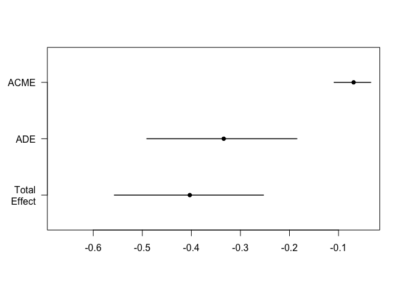
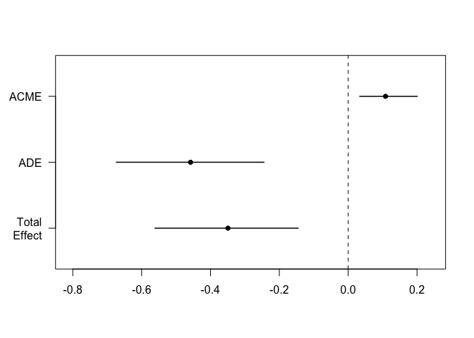

# Mediation Analysis for Microbiome Data
Giulio Benedetti

## Dataset 1

``` r
tse <- LahtiWAData()
```

### Mediation of alpha diversity

``` r
colData(tse)$bmi_group <- as.numeric(tse$bmi_group)

med_out <- mediateColData(tse,
                          outcome = "bmi_group",
                          treatment = "nationality",
                          mediator = "diversity",
                          covariates = c("sex", "age"),
                          treat.value = "Scandinavia",
                          control.value = "CentralEurope",
                          boot = TRUE, sims = 1000)
```

    115 samples removed because of missing data.

    164 samples removed because different from control and treatment.

    Running nonparametric bootstrap

``` r
summary(med_out)
```


    Causal Mediation Analysis 

    Nonparametric Bootstrap Confidence Intervals with the Percentile Method

    (Inference Conditional on the Covariate Values Specified in `covariates')

                   Estimate 95% CI Lower 95% CI Upper p-value    
    ACME            -0.0762      -0.1170        -0.04  <2e-16 ***
    ADE             -0.2784      -0.4234        -0.13  <2e-16 ***
    Total Effect    -0.3547      -0.4991        -0.20  <2e-16 ***
    Prop. Mediated   0.2149       0.1138         0.41  <2e-16 ***
    ---
    Signif. codes:  0 '***' 0.001 '**' 0.01 '*' 0.05 '.' 0.1 ' ' 1

    Sample Size Used: 872 


    Simulations: 1000 

``` r
plot(med_out)
```



### Mediation of microbiome assay

``` r
tse <- tse[ , !is.na(tse$bmi_group)]
tse <- tse[ , !is.na(tse$nationality)]

tse <- tse[ , tse$nationality %in% c("CentralEurope", "Scandinavia")]
colData(tse)$nationality <- as.numeric(factor(tse$nationality)) - 1

tse <- transformAssay(tse,
                      method = "clr",
                      pseudocount = 1)
```

``` r
hdma_res <- mediate_hdma(A = tse$nationality,
                         M = t(assay(tse, "clr")),
                         Y = tse$bmi_group)
```

    Screening mediators...

    Fitting outcome model with de-biased LASSO...

    Fitting mediator models...

``` r
hdma_res$effects %>% knitr::kable()
```

<table>
<thead>
<tr class="header">
<th style="text-align: left;">effect</th>
<th style="text-align: right;">estimate</th>
</tr>
</thead>
<tbody>
<tr class="odd">
<td style="text-align: left;">indirect</td>
<td style="text-align: right;">0.0499786</td>
</tr>
<tr class="even">
<td style="text-align: left;">direct</td>
<td style="text-align: right;">-0.4531502</td>
</tr>
<tr class="odd">
<td style="text-align: left;">total</td>
<td style="text-align: right;">-0.4031716</td>
</tr>
</tbody>
</table>

``` r
hdma_res$contributions %>% 
  filter(ab_pv < 0.05) %>%
  knitr::kable()
```

<table>
<colgroup>
<col style="width: 34%" />
<col style="width: 11%" />
<col style="width: 10%" />
<col style="width: 11%" />
<col style="width: 10%" />
<col style="width: 11%" />
<col style="width: 10%" />
</colgroup>
<thead>
<tr class="header">
<th style="text-align: left;">mediator</th>
<th style="text-align: right;">alpha</th>
<th style="text-align: right;">alpha_pv</th>
<th style="text-align: right;">beta</th>
<th style="text-align: right;">beta_pv</th>
<th style="text-align: right;">alpha_beta</th>
<th style="text-align: right;">ab_pv</th>
</tr>
</thead>
<tbody>
<tr class="odd">
<td style="text-align: left;">Bacteroides uniformis et rel.</td>
<td style="text-align: right;">-0.3018067</td>
<td style="text-align: right;">0.0039828</td>
<td style="text-align: right;">-0.1276184</td>
<td style="text-align: right;">0.0493984</td>
<td style="text-align: right;">0.0385161</td>
<td style="text-align: right;">0.0493984</td>
</tr>
<tr class="even">
<td style="text-align: left;">Bifidobacterium</td>
<td style="text-align: right;">0.8304660</td>
<td style="text-align: right;">0.0000000</td>
<td style="text-align: right;">-0.1127872</td>
<td style="text-align: right;">0.0299746</td>
<td style="text-align: right;">-0.0936659</td>
<td style="text-align: right;">0.0299746</td>
</tr>
<tr class="odd">
<td style="text-align: left;">Brachyspira</td>
<td style="text-align: right;">0.0851664</td>
<td style="text-align: right;">0.0003479</td>
<td style="text-align: right;">0.4639224</td>
<td style="text-align: right;">0.0477823</td>
<td style="text-align: right;">0.0395106</td>
<td style="text-align: right;">0.0477823</td>
</tr>
<tr class="even">
<td style="text-align: left;">Burkholderia</td>
<td style="text-align: right;">-0.3292429</td>
<td style="text-align: right;">0.0000000</td>
<td style="text-align: right;">0.3402953</td>
<td style="text-align: right;">0.0031897</td>
<td style="text-align: right;">-0.1120398</td>
<td style="text-align: right;">0.0031897</td>
</tr>
<tr class="odd">
<td style="text-align: left;">Clostridium ramosum et rel.</td>
<td style="text-align: right;">0.1414295</td>
<td style="text-align: right;">0.0000001</td>
<td style="text-align: right;">-0.6585045</td>
<td style="text-align: right;">0.0001262</td>
<td style="text-align: right;">-0.0931319</td>
<td style="text-align: right;">0.0001262</td>
</tr>
<tr class="even">
<td style="text-align: left;">Clostridium stercorarium et rel.</td>
<td style="text-align: right;">0.4932670</td>
<td style="text-align: right;">0.0000000</td>
<td style="text-align: right;">0.1524069</td>
<td style="text-align: right;">0.0293580</td>
<td style="text-align: right;">0.0751773</td>
<td style="text-align: right;">0.0293580</td>
</tr>
<tr class="odd">
<td style="text-align: left;">Eggerthella lenta et rel.</td>
<td style="text-align: right;">0.2133013</td>
<td style="text-align: right;">0.0000000</td>
<td style="text-align: right;">0.5168749</td>
<td style="text-align: right;">0.0003797</td>
<td style="text-align: right;">0.1102501</td>
<td style="text-align: right;">0.0003797</td>
</tr>
<tr class="even">
<td style="text-align: left;">Megasphaera elsdenii et rel.</td>
<td style="text-align: right;">-0.1113495</td>
<td style="text-align: right;">0.0245656</td>
<td style="text-align: right;">0.2394733</td>
<td style="text-align: right;">0.0049181</td>
<td style="text-align: right;">-0.0266652</td>
<td style="text-align: right;">0.0245656</td>
</tr>
<tr class="odd">
<td style="text-align: left;">Ruminococcus gnavus et rel.</td>
<td style="text-align: right;">0.3970603</td>
<td style="text-align: right;">0.0000000</td>
<td style="text-align: right;">0.1990542</td>
<td style="text-align: right;">0.0129413</td>
<td style="text-align: right;">0.0790365</td>
<td style="text-align: right;">0.0129413</td>
</tr>
<tr class="even">
<td style="text-align: left;">Xanthomonadaceae</td>
<td style="text-align: right;">-0.1809858</td>
<td style="text-align: right;">0.0000001</td>
<td style="text-align: right;">-0.2634616</td>
<td style="text-align: right;">0.0473508</td>
<td style="text-align: right;">0.0476828</td>
<td style="text-align: right;">0.0473508</td>
</tr>
</tbody>
</table>

## Dataset 2

``` r
tse <- OKeefeDSData()
```

``` r
tse <- transformAssay(tse,
                      method = "relabundance")

tse <- estimateDiversity(tse,
                         index = "shannon",
                         assay.type = "relabundance")
```

### Mediation of alpha diversity

``` r
colData(tse)$bmi_group <- as.numeric(tse$bmi_group)

med_out <- mediateColData(tse,
                          outcome = "bmi_group",
                          treatment = "nationality",
                          mediator = "shannon",
                          covariates = "timepoint.within.group",
                          boot = TRUE, sims = 1000)
```

    Running nonparametric bootstrap

``` r
summary(med_out)
```


    Causal Mediation Analysis 

    Nonparametric Bootstrap Confidence Intervals with the Percentile Method

    (Inference Conditional on the Covariate Values Specified in `covariates')

                   Estimate 95% CI Lower 95% CI Upper p-value    
    ACME             0.1086       0.0335         0.20   0.012 *  
    ADE             -0.4580      -0.6735        -0.24  <2e-16 ***
    Total Effect    -0.3493      -0.5615        -0.15  <2e-16 ***
    Prop. Mediated  -0.3110      -0.9174        -0.09   0.012 *  
    ---
    Signif. codes:  0 '***' 0.001 '**' 0.01 '*' 0.05 '.' 0.1 ' ' 1

    Sample Size Used: 222 


    Simulations: 1000 

``` r
plot(med_out)
```



### Mediation of microbiome assay

``` r
tse <- tse[ , !is.na(tse$bmi_group)]
tse <- tse[ , !is.na(tse$nationality)]

colData(tse)$nationality <- as.numeric(factor(tse$nationality)) - 1

tse <- transformAssay(tse,
                      method = "clr",
                      pseudocount = 1)
```

``` r
tse <- tse[ , tse$timepoint.within.group == 2]

hdma_res <- mediate_spcma(A = tse$nationality,
                         M = t(assay(tse, "clr")),
                         Y = tse$bmi_group)#,
                         #C1 = matrix(tse$timepoint.within.group))
```

``` r
hdma_res$effects %>% knitr::kable()
```

<table>
<colgroup>
<col style="width: 8%" />
<col style="width: 18%" />
<col style="width: 17%" />
<col style="width: 18%" />
<col style="width: 19%" />
<col style="width: 17%" />
</colgroup>
<thead>
<tr class="header">
<th style="text-align: left;">effect</th>
<th style="text-align: left;">estimate</th>
<th style="text-align: left;">se</th>
<th style="text-align: left;">cl_2.5%</th>
<th style="text-align: left;">cl_97.5%</th>
<th style="text-align: left;">pv</th>
</tr>
</thead>
<tbody>
<tr class="odd">
<td style="text-align: left;">indirect</td>
<td style="text-align: left;">0.138450307443018</td>
<td style="text-align: left;">0.275989632763603</td>
<td style="text-align: left;">-0.399804600514614</td>
<td style="text-align: left;">0.664133696200351</td>
<td style="text-align: left;">0.615913465779439</td>
</tr>
<tr class="even">
<td style="text-align: left;">direct</td>
<td style="text-align: left;">-0.507135486432648</td>
<td style="text-align: left;">0.314701267996377</td>
<td style="text-align: left;">-1.12052623113302</td>
<td style="text-align: left;">0.0904406587693171</td>
<td style="text-align: left;">0.10707466744474</td>
</tr>
<tr class="odd">
<td style="text-align: left;">total</td>
<td style="text-align: left;">-0.36868517898963</td>
<td style="text-align: left;">0.153427902123304</td>
<td style="text-align: left;">-0.673292066998711</td>
<td style="text-align: left;">-0.0818922251682425</td>
<td style="text-align: left;">0.016</td>
</tr>
</tbody>
</table>

``` r
hdma_res$contributions %>% 
  filter(ab_pv < 0.05) %>%
  knitr::kable()
```

<table>
<colgroup>
<col style="width: 6%" />
<col style="width: 10%" />
<col style="width: 12%" />
<col style="width: 11%" />
<col style="width: 12%" />
<col style="width: 11%" />
<col style="width: 12%" />
<col style="width: 13%" />
<col style="width: 6%" />
</colgroup>
<thead>
<tr class="header">
<th style="text-align: left;"></th>
<th style="text-align: left;">mediator</th>
<th style="text-align: right;">alpha</th>
<th style="text-align: right;">beta</th>
<th style="text-align: right;">alpha_beta</th>
<th style="text-align: right;">ab_se</th>
<th style="text-align: right;">ab_cl_2.5%</th>
<th style="text-align: right;">ab_cl_97.5%</th>
<th style="text-align: right;">ab_pv</th>
</tr>
</thead>
<tbody>
<tr class="odd">
<td style="text-align: left;">spc7</td>
<td style="text-align: left;">spc7</td>
<td style="text-align: right;">1.8839684</td>
<td style="text-align: right;">0.1311627</td>
<td style="text-align: right;">0.2471064</td>
<td style="text-align: right;">0.0990699</td>
<td style="text-align: right;">0.0897677</td>
<td style="text-align: right;">0.4770913</td>
<td style="text-align: right;">0.00</td>
</tr>
<tr class="even">
<td style="text-align: left;">spc17</td>
<td style="text-align: left;">spc17</td>
<td style="text-align: right;">-0.9107473</td>
<td style="text-align: right;">0.1804736</td>
<td style="text-align: right;">-0.1643658</td>
<td style="text-align: right;">0.0778319</td>
<td style="text-align: right;">-0.3450632</td>
<td style="text-align: right;">-0.0425960</td>
<td style="text-align: right;">0.01</td>
</tr>
</tbody>
</table>
