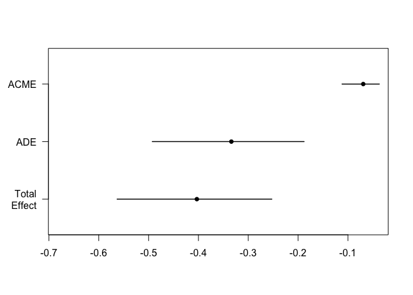

# Mediation Analysis for Microbiome Data
Giulio Benedetti

## setup

``` r
# Import utilities
source("funs.R")
```

    Loading required package: SummarizedExperiment

    Loading required package: MatrixGenerics

    Loading required package: matrixStats


    Attaching package: 'MatrixGenerics'

    The following objects are masked from 'package:matrixStats':

        colAlls, colAnyNAs, colAnys, colAvgsPerRowSet, colCollapse,
        colCounts, colCummaxs, colCummins, colCumprods, colCumsums,
        colDiffs, colIQRDiffs, colIQRs, colLogSumExps, colMadDiffs,
        colMads, colMaxs, colMeans2, colMedians, colMins, colOrderStats,
        colProds, colQuantiles, colRanges, colRanks, colSdDiffs, colSds,
        colSums2, colTabulates, colVarDiffs, colVars, colWeightedMads,
        colWeightedMeans, colWeightedMedians, colWeightedSds,
        colWeightedVars, rowAlls, rowAnyNAs, rowAnys, rowAvgsPerColSet,
        rowCollapse, rowCounts, rowCummaxs, rowCummins, rowCumprods,
        rowCumsums, rowDiffs, rowIQRDiffs, rowIQRs, rowLogSumExps,
        rowMadDiffs, rowMads, rowMaxs, rowMeans2, rowMedians, rowMins,
        rowOrderStats, rowProds, rowQuantiles, rowRanges, rowRanks,
        rowSdDiffs, rowSds, rowSums2, rowTabulates, rowVarDiffs, rowVars,
        rowWeightedMads, rowWeightedMeans, rowWeightedMedians,
        rowWeightedSds, rowWeightedVars

    Loading required package: GenomicRanges

    Loading required package: stats4

    Loading required package: BiocGenerics


    Attaching package: 'BiocGenerics'

    The following objects are masked from 'package:stats':

        IQR, mad, sd, var, xtabs

    The following objects are masked from 'package:base':

        anyDuplicated, aperm, append, as.data.frame, basename, cbind,
        colnames, dirname, do.call, duplicated, eval, evalq, Filter, Find,
        get, grep, grepl, intersect, is.unsorted, lapply, Map, mapply,
        match, mget, order, paste, pmax, pmax.int, pmin, pmin.int,
        Position, rank, rbind, Reduce, rownames, sapply, setdiff, sort,
        table, tapply, union, unique, unsplit, which.max, which.min

    Loading required package: S4Vectors

    Warning: package 'S4Vectors' was built under R version 4.3.2


    Attaching package: 'S4Vectors'

    The following object is masked from 'package:utils':

        findMatches

    The following objects are masked from 'package:base':

        expand.grid, I, unname

    Loading required package: IRanges

    Loading required package: GenomeInfoDb

    Warning: package 'GenomeInfoDb' was built under R version 4.3.2

    Loading required package: Biobase

    Welcome to Bioconductor

        Vignettes contain introductory material; view with
        'browseVignettes()'. To cite Bioconductor, see
        'citation("Biobase")', and for packages 'citation("pkgname")'.


    Attaching package: 'Biobase'

    The following object is masked from 'package:MatrixGenerics':

        rowMedians

    The following objects are masked from 'package:matrixStats':

        anyMissing, rowMedians

    Loading required package: SingleCellExperiment

    Loading required package: TreeSummarizedExperiment

    Loading required package: Biostrings

    Warning: package 'Biostrings' was built under R version 4.3.2

    Loading required package: XVector


    Attaching package: 'Biostrings'

    The following object is masked from 'package:base':

        strsplit

    Loading required package: MultiAssayExperiment


    Attaching package: 'dplyr'

    The following objects are masked from 'package:mia':

        full_join, inner_join, left_join, right_join

    The following objects are masked from 'package:Biostrings':

        collapse, intersect, setdiff, setequal, union

    The following object is masked from 'package:XVector':

        slice

    The following object is masked from 'package:Biobase':

        combine

    The following objects are masked from 'package:GenomicRanges':

        intersect, setdiff, union

    The following object is masked from 'package:GenomeInfoDb':

        intersect

    The following objects are masked from 'package:IRanges':

        collapse, desc, intersect, setdiff, slice, union

    The following objects are masked from 'package:S4Vectors':

        first, intersect, rename, setdiff, setequal, union

    The following objects are masked from 'package:BiocGenerics':

        combine, intersect, setdiff, union

    The following object is masked from 'package:matrixStats':

        count

    The following objects are masked from 'package:stats':

        filter, lag

    The following objects are masked from 'package:base':

        intersect, setdiff, setequal, union

    Warning: package 'tidyr' was built under R version 4.3.2


    Attaching package: 'tidyr'

    The following object is masked from 'package:S4Vectors':

        expand

    Loading required package: MASS


    Attaching package: 'MASS'

    The following object is masked from 'package:dplyr':

        select

    Loading required package: Matrix


    Attaching package: 'Matrix'

    The following objects are masked from 'package:tidyr':

        expand, pack, unpack

    The following object is masked from 'package:S4Vectors':

        expand

    Loading required package: mvtnorm

    Loading required package: sandwich

    mediation: Causal Mediation Analysis
    Version: 4.5.0

``` r
# Set chunks options
knitr::opts_chunk$set(warning = FALSE)
```

``` r
tse <- LahtiWAData()
```

    see ?microbiomeDataSets and browseVignettes('microbiomeDataSets') for documentation

    loading from cache

    see ?microbiomeDataSets and browseVignettes('microbiomeDataSets') for documentation

    loading from cache

    see ?microbiomeDataSets and browseVignettes('microbiomeDataSets') for documentation

    loading from cache

``` r
tse <- tse[ , !is.na(tse$bmi_group)]
tse <- tse[ , !is.na(tse$nationality)]

colData(tse)$bmi_group <- as.numeric(tse$bmi_group)

tse <- tse[ , tse$nationality %in% c("CentralEurope", "Scandinavia")]
colData(tse)$nationality <- as.numeric(factor(tse$nationality)) - 1
```

``` r
med_out <- mediate_coldata(tse,
                           outcome = "bmi_group",
                           treatment = "nationality",
                           mediator = "diversity",
                           boot = TRUE, sims = 1000)
```

    Running nonparametric bootstrap

``` r
summary(med_out)
```


    Causal Mediation Analysis 

    Nonparametric Bootstrap Confidence Intervals with the Percentile Method

                   Estimate 95% CI Lower 95% CI Upper p-value    
    ACME            -0.0693      -0.1118        -0.04  <2e-16 ***
    ADE             -0.3339      -0.4926        -0.19  <2e-16 ***
    Total Effect    -0.4032      -0.5632        -0.25  <2e-16 ***
    Prop. Mediated   0.1718       0.0885         0.30  <2e-16 ***
    ---
    Signif. codes:  0 '***' 0.001 '**' 0.01 '*' 0.05 '.' 0.1 ' ' 1

    Sample Size Used: 872 


    Simulations: 1000 

``` r
plot(med_out)
```



``` r
tse <- transformAssay(tse,
                      method = "clr",
                      pseudocount = 1)

hdma_res <- mediate_hdma(A = tse$nationality,
                         M = t(assay(tse, "clr")),
                         Y = tse$bmi_group)
```

    Screening mediators...

    Fitting outcome model with de-biased LASSO...

    Fitting mediator models...

``` r
hdma_res$effects %>% knitr::kable()
```

<table>
<thead>
<tr class="header">
<th style="text-align: left;">effect</th>
<th style="text-align: right;">estimate</th>
</tr>
</thead>
<tbody>
<tr class="odd">
<td style="text-align: left;">indirect</td>
<td style="text-align: right;">0.0334797</td>
</tr>
<tr class="even">
<td style="text-align: left;">direct</td>
<td style="text-align: right;">-0.4366512</td>
</tr>
<tr class="odd">
<td style="text-align: left;">total</td>
<td style="text-align: right;">-0.4031716</td>
</tr>
</tbody>
</table>

``` r
hdma_res$contributions %>% 
  filter(ab_pv < 0.05) %>%
  knitr::kable()
```

<table>
<colgroup>
<col style="width: 34%" />
<col style="width: 11%" />
<col style="width: 10%" />
<col style="width: 11%" />
<col style="width: 10%" />
<col style="width: 11%" />
<col style="width: 10%" />
</colgroup>
<thead>
<tr class="header">
<th style="text-align: left;">mediator</th>
<th style="text-align: right;">alpha</th>
<th style="text-align: right;">alpha_pv</th>
<th style="text-align: right;">beta</th>
<th style="text-align: right;">beta_pv</th>
<th style="text-align: right;">alpha_beta</th>
<th style="text-align: right;">ab_pv</th>
</tr>
</thead>
<tbody>
<tr class="odd">
<td style="text-align: left;">Bacteroides uniformis et rel.</td>
<td style="text-align: right;">-0.3018067</td>
<td style="text-align: right;">0.0039828</td>
<td style="text-align: right;">-0.1292029</td>
<td style="text-align: right;">0.0438381</td>
<td style="text-align: right;">0.0389943</td>
<td style="text-align: right;">0.0438381</td>
</tr>
<tr class="even">
<td style="text-align: left;">Bifidobacterium</td>
<td style="text-align: right;">0.8304660</td>
<td style="text-align: right;">0.0000000</td>
<td style="text-align: right;">-0.1140157</td>
<td style="text-align: right;">0.0262258</td>
<td style="text-align: right;">-0.0946862</td>
<td style="text-align: right;">0.0262258</td>
</tr>
<tr class="odd">
<td style="text-align: left;">Brachyspira</td>
<td style="text-align: right;">0.0851664</td>
<td style="text-align: right;">0.0003479</td>
<td style="text-align: right;">0.4626129</td>
<td style="text-align: right;">0.0452987</td>
<td style="text-align: right;">0.0393991</td>
<td style="text-align: right;">0.0452987</td>
</tr>
<tr class="even">
<td style="text-align: left;">Burkholderia</td>
<td style="text-align: right;">-0.3292429</td>
<td style="text-align: right;">0.0000000</td>
<td style="text-align: right;">0.3391729</td>
<td style="text-align: right;">0.0029044</td>
<td style="text-align: right;">-0.1116703</td>
<td style="text-align: right;">0.0029044</td>
</tr>
<tr class="odd">
<td style="text-align: left;">Clostridium ramosum et rel.</td>
<td style="text-align: right;">0.1414295</td>
<td style="text-align: right;">0.0000001</td>
<td style="text-align: right;">-0.6586752</td>
<td style="text-align: right;">0.0001036</td>
<td style="text-align: right;">-0.0931561</td>
<td style="text-align: right;">0.0001036</td>
</tr>
<tr class="even">
<td style="text-align: left;">Clostridium stercorarium et rel.</td>
<td style="text-align: right;">0.4932670</td>
<td style="text-align: right;">0.0000000</td>
<td style="text-align: right;">0.1512585</td>
<td style="text-align: right;">0.0284811</td>
<td style="text-align: right;">0.0746108</td>
<td style="text-align: right;">0.0284811</td>
</tr>
<tr class="odd">
<td style="text-align: left;">Eggerthella lenta et rel.</td>
<td style="text-align: right;">0.2133013</td>
<td style="text-align: right;">0.0000000</td>
<td style="text-align: right;">0.5156467</td>
<td style="text-align: right;">0.0003283</td>
<td style="text-align: right;">0.1099881</td>
<td style="text-align: right;">0.0003283</td>
</tr>
<tr class="even">
<td style="text-align: left;">Lactobacillus gasseri et rel.</td>
<td style="text-align: right;">0.0602800</td>
<td style="text-align: right;">0.0265373</td>
<td style="text-align: right;">-0.2561590</td>
<td style="text-align: right;">0.0469872</td>
<td style="text-align: right;">-0.0154413</td>
<td style="text-align: right;">0.0469872</td>
</tr>
<tr class="odd">
<td style="text-align: left;">Megasphaera elsdenii et rel.</td>
<td style="text-align: right;">-0.1113495</td>
<td style="text-align: right;">0.0245656</td>
<td style="text-align: right;">0.2379903</td>
<td style="text-align: right;">0.0046316</td>
<td style="text-align: right;">-0.0265001</td>
<td style="text-align: right;">0.0245656</td>
</tr>
<tr class="even">
<td style="text-align: left;">Ruminococcus gnavus et rel.</td>
<td style="text-align: right;">0.3970603</td>
<td style="text-align: right;">0.0000000</td>
<td style="text-align: right;">0.1979375</td>
<td style="text-align: right;">0.0122847</td>
<td style="text-align: right;">0.0785931</td>
<td style="text-align: right;">0.0122847</td>
</tr>
<tr class="odd">
<td style="text-align: left;">Xanthomonadaceae</td>
<td style="text-align: right;">-0.1809858</td>
<td style="text-align: right;">0.0000001</td>
<td style="text-align: right;">-0.2648703</td>
<td style="text-align: right;">0.0433929</td>
<td style="text-align: right;">0.0479378</td>
<td style="text-align: right;">0.0433929</td>
</tr>
</tbody>
</table>

``` r
tse <- OKeefeDSData()
```

    see ?microbiomeDataSets and browseVignettes('microbiomeDataSets') for documentation

    loading from cache

    see ?microbiomeDataSets and browseVignettes('microbiomeDataSets') for documentation

    loading from cache

    see ?microbiomeDataSets and browseVignettes('microbiomeDataSets') for documentation

    loading from cache

``` r
tse <- transformAssay(tse,
                      method = "relabundance")

tse <- estimateDiversity(tse,
                         index = "shannon",
                         assay.type = "relabundance")
```

``` r
tse <- tse[ , !is.na(tse$bmi_group)]
tse <- tse[ , !is.na(tse$nationality)]

colData(tse)$bmi_group <- as.numeric(tse$bmi_group)

colData(tse)$nationality <- as.numeric(factor(tse$nationality))
```

``` r
med_out <- mediate_coldata(tse,
                          outcome = "bmi_group",
                          treatment = "nationality",
                          mediator = "shannon",
                          boot = TRUE, sims = 1000)
```

    Running nonparametric bootstrap

``` r
summary(med_out)
```


    Causal Mediation Analysis 

    Nonparametric Bootstrap Confidence Intervals with the Percentile Method

                   Estimate 95% CI Lower 95% CI Upper p-value    
    ACME             0.1081       0.0329         0.19   0.004 ** 
    ADE             -0.4575      -0.6695        -0.23  <2e-16 ***
    Total Effect    -0.3493      -0.5584        -0.14   0.002 ** 
    Prop. Mediated  -0.3095      -0.8662        -0.08   0.006 ** 
    ---
    Signif. codes:  0 '***' 0.001 '**' 0.01 '*' 0.05 '.' 0.1 ' ' 1

    Sample Size Used: 222 


    Simulations: 1000 

``` r
plot(med_out)
```


``` r
tse <- transformAssay(tse,
                      method = "clr",
                      pseudocount = 1)

hdma_res <- mediate_hdma(A = tse$nationality,
                         M = t(assay(tse, "clr")),
                         Y = tse$bmi_group)
```

    Screening mediators...

    Fitting outcome model with de-biased LASSO...

    Fitting mediator models...

``` r
hdma_res$effects %>% knitr::kable()
```

<table>
<thead>
<tr class="header">
<th style="text-align: left;">effect</th>
<th style="text-align: right;">estimate</th>
</tr>
</thead>
<tbody>
<tr class="odd">
<td style="text-align: left;">indirect</td>
<td style="text-align: right;">-0.0608436</td>
</tr>
<tr class="even">
<td style="text-align: left;">direct</td>
<td style="text-align: right;">-0.2885035</td>
</tr>
<tr class="odd">
<td style="text-align: left;">total</td>
<td style="text-align: right;">-0.3493471</td>
</tr>
</tbody>
</table>

``` r
hdma_res$contributions %>% 
  filter(ab_pv < 0.05) %>%
  knitr::kable()
```

<table>
<colgroup>
<col style="width: 34%" />
<col style="width: 11%" />
<col style="width: 10%" />
<col style="width: 11%" />
<col style="width: 10%" />
<col style="width: 11%" />
<col style="width: 10%" />
</colgroup>
<thead>
<tr class="header">
<th style="text-align: left;">mediator</th>
<th style="text-align: right;">alpha</th>
<th style="text-align: right;">alpha_pv</th>
<th style="text-align: right;">beta</th>
<th style="text-align: right;">beta_pv</th>
<th style="text-align: right;">alpha_beta</th>
<th style="text-align: right;">ab_pv</th>
</tr>
</thead>
<tbody>
<tr class="odd">
<td style="text-align: left;">Bifidobacterium</td>
<td style="text-align: right;">-0.3659494</td>
<td style="text-align: right;">0.0028767</td>
<td style="text-align: right;">0.1775240</td>
<td style="text-align: right;">0.0191975</td>
<td style="text-align: right;">-0.0649648</td>
<td style="text-align: right;">0.0191975</td>
</tr>
<tr class="even">
<td style="text-align: left;">Moraxellaceae</td>
<td style="text-align: right;">0.3247997</td>
<td style="text-align: right;">0.0000000</td>
<td style="text-align: right;">-0.3153979</td>
<td style="text-align: right;">0.0423614</td>
<td style="text-align: right;">-0.1024411</td>
<td style="text-align: right;">0.0423614</td>
</tr>
<tr class="odd">
<td style="text-align: left;">Sporobacter termitidis et rel.</td>
<td style="text-align: right;">0.3940421</td>
<td style="text-align: right;">0.0009216</td>
<td style="text-align: right;">0.1927613</td>
<td style="text-align: right;">0.0327613</td>
<td style="text-align: right;">0.0759561</td>
<td style="text-align: right;">0.0327613</td>
</tr>
<tr class="even">
<td style="text-align: left;">Subdoligranulum variable at rel.</td>
<td style="text-align: right;">-0.3198996</td>
<td style="text-align: right;">0.0036013</td>
<td style="text-align: right;">0.1778873</td>
<td style="text-align: right;">0.0313979</td>
<td style="text-align: right;">-0.0569061</td>
<td style="text-align: right;">0.0313979</td>
</tr>
</tbody>
</table>
