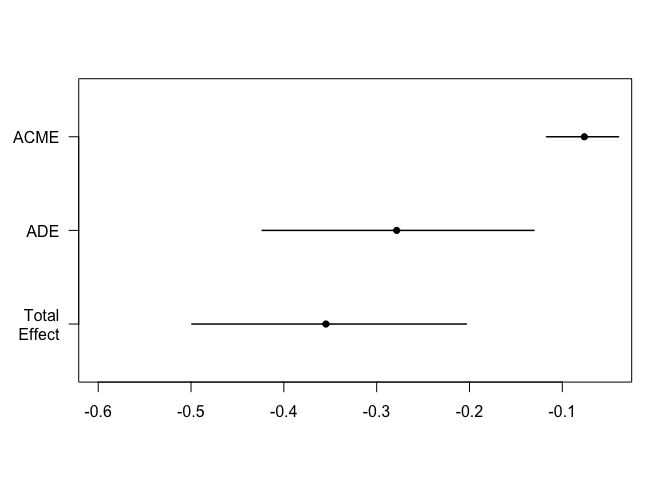

# Mediation Analysis for Microbiome Data
Giulio Benedetti

## setup

## Dataset 1

``` r
tse <- LahtiWAData()
```

``` r
tse <- tse[ , !is.na(tse$bmi_group)]
tse <- tse[ , !is.na(tse$nationality)]

colData(tse)$bmi_group <- as.numeric(tse$bmi_group)

tse <- tse[ , tse$nationality %in% c("CentralEurope", "Scandinavia")]
colData(tse)$nationality <- as.numeric(factor(tse$nationality)) - 1
```

### Mediation of alpha diversity

``` r
med_out <- mediate_coldata(tse,
                           outcome = "bmi_group",
                           treatment = "nationality",
                           mediator = "diversity",
                           boot = TRUE, sims = 1000)
```

    Running nonparametric bootstrap

``` r
summary(med_out)
```


    Causal Mediation Analysis 

    Nonparametric Bootstrap Confidence Intervals with the Percentile Method

                   Estimate 95% CI Lower 95% CI Upper p-value    
    ACME            -0.0693      -0.1091        -0.03  <2e-16 ***
    ADE             -0.3339      -0.4909        -0.18  <2e-16 ***
    Total Effect    -0.4032      -0.5571        -0.25  <2e-16 ***
    Prop. Mediated   0.1718       0.0822         0.30  <2e-16 ***
    ---
    Signif. codes:  0 '***' 0.001 '**' 0.01 '*' 0.05 '.' 0.1 ' ' 1

    Sample Size Used: 872 


    Simulations: 1000 

``` r
plot(med_out)
```



### Mediation of microbiome assay

``` r
tse <- transformAssay(tse,
                      method = "clr",
                      pseudocount = 1)

hdma_res <- mediate_hdma(A = tse$nationality,
                         M = t(assay(tse, "clr")),
                         Y = tse$bmi_group)
```

    Screening mediators...

    Fitting outcome model with de-biased LASSO...

    Fitting mediator models...

``` r
hdma_res$effects %>% knitr::kable()
```

<table>
<thead>
<tr class="header">
<th style="text-align: left;">effect</th>
<th style="text-align: right;">estimate</th>
</tr>
</thead>
<tbody>
<tr class="odd">
<td style="text-align: left;">indirect</td>
<td style="text-align: right;">0.0335849</td>
</tr>
<tr class="even">
<td style="text-align: left;">direct</td>
<td style="text-align: right;">-0.4367565</td>
</tr>
<tr class="odd">
<td style="text-align: left;">total</td>
<td style="text-align: right;">-0.4031716</td>
</tr>
</tbody>
</table>

``` r
hdma_res$contributions %>% 
  filter(ab_pv < 0.05) %>%
  knitr::kable()
```

<table>
<colgroup>
<col style="width: 34%" />
<col style="width: 11%" />
<col style="width: 10%" />
<col style="width: 11%" />
<col style="width: 10%" />
<col style="width: 11%" />
<col style="width: 10%" />
</colgroup>
<thead>
<tr class="header">
<th style="text-align: left;">mediator</th>
<th style="text-align: right;">alpha</th>
<th style="text-align: right;">alpha_pv</th>
<th style="text-align: right;">beta</th>
<th style="text-align: right;">beta_pv</th>
<th style="text-align: right;">alpha_beta</th>
<th style="text-align: right;">ab_pv</th>
</tr>
</thead>
<tbody>
<tr class="odd">
<td style="text-align: left;">Bacteroides uniformis et rel.</td>
<td style="text-align: right;">-0.3018067</td>
<td style="text-align: right;">0.0039828</td>
<td style="text-align: right;">-0.1295027</td>
<td style="text-align: right;">0.0424570</td>
<td style="text-align: right;">0.0390848</td>
<td style="text-align: right;">0.0424570</td>
</tr>
<tr class="even">
<td style="text-align: left;">Bifidobacterium</td>
<td style="text-align: right;">0.8304660</td>
<td style="text-align: right;">0.0000000</td>
<td style="text-align: right;">-0.1141412</td>
<td style="text-align: right;">0.0254252</td>
<td style="text-align: right;">-0.0947904</td>
<td style="text-align: right;">0.0254252</td>
</tr>
<tr class="odd">
<td style="text-align: left;">Brachyspira</td>
<td style="text-align: right;">0.0851664</td>
<td style="text-align: right;">0.0003479</td>
<td style="text-align: right;">0.4630257</td>
<td style="text-align: right;">0.0444303</td>
<td style="text-align: right;">0.0394342</td>
<td style="text-align: right;">0.0444303</td>
</tr>
<tr class="even">
<td style="text-align: left;">Burkholderia</td>
<td style="text-align: right;">-0.3292429</td>
<td style="text-align: right;">0.0000000</td>
<td style="text-align: right;">0.3390329</td>
<td style="text-align: right;">0.0027965</td>
<td style="text-align: right;">-0.1116242</td>
<td style="text-align: right;">0.0027965</td>
</tr>
<tr class="odd">
<td style="text-align: left;">Clostridium ramosum et rel.</td>
<td style="text-align: right;">0.1414295</td>
<td style="text-align: right;">0.0000001</td>
<td style="text-align: right;">-0.6591253</td>
<td style="text-align: right;">0.0000944</td>
<td style="text-align: right;">-0.0932197</td>
<td style="text-align: right;">0.0000944</td>
</tr>
<tr class="even">
<td style="text-align: left;">Clostridium stercorarium et rel.</td>
<td style="text-align: right;">0.4932670</td>
<td style="text-align: right;">0.0000000</td>
<td style="text-align: right;">0.1512266</td>
<td style="text-align: right;">0.0278379</td>
<td style="text-align: right;">0.0745951</td>
<td style="text-align: right;">0.0278379</td>
</tr>
<tr class="odd">
<td style="text-align: left;">Eggerthella lenta et rel.</td>
<td style="text-align: right;">0.2133013</td>
<td style="text-align: right;">0.0000000</td>
<td style="text-align: right;">0.5154995</td>
<td style="text-align: right;">0.0003106</td>
<td style="text-align: right;">0.1099567</td>
<td style="text-align: right;">0.0003106</td>
</tr>
<tr class="even">
<td style="text-align: left;">Lactobacillus gasseri et rel.</td>
<td style="text-align: right;">0.0602800</td>
<td style="text-align: right;">0.0265373</td>
<td style="text-align: right;">-0.2545782</td>
<td style="text-align: right;">0.0470368</td>
<td style="text-align: right;">-0.0153460</td>
<td style="text-align: right;">0.0470368</td>
</tr>
<tr class="odd">
<td style="text-align: left;">Megasphaera elsdenii et rel.</td>
<td style="text-align: right;">-0.1113495</td>
<td style="text-align: right;">0.0245656</td>
<td style="text-align: right;">0.2377194</td>
<td style="text-align: right;">0.0045035</td>
<td style="text-align: right;">-0.0264699</td>
<td style="text-align: right;">0.0245656</td>
</tr>
<tr class="even">
<td style="text-align: left;">Ruminococcus gnavus et rel.</td>
<td style="text-align: right;">0.3970603</td>
<td style="text-align: right;">0.0000000</td>
<td style="text-align: right;">0.1979132</td>
<td style="text-align: right;">0.0119258</td>
<td style="text-align: right;">0.0785835</td>
<td style="text-align: right;">0.0119258</td>
</tr>
<tr class="odd">
<td style="text-align: left;">Xanthomonadaceae</td>
<td style="text-align: right;">-0.1809858</td>
<td style="text-align: right;">0.0000001</td>
<td style="text-align: right;">-0.2650841</td>
<td style="text-align: right;">0.0423318</td>
<td style="text-align: right;">0.0479765</td>
<td style="text-align: right;">0.0423318</td>
</tr>
</tbody>
</table>

## Dataset 2

``` r
tse <- OKeefeDSData()
```

``` r
tse <- transformAssay(tse,
                      method = "relabundance")

tse <- estimateDiversity(tse,
                         index = "shannon",
                         assay.type = "relabundance")
```

``` r
tse <- tse[ , !is.na(tse$bmi_group)]
tse <- tse[ , !is.na(tse$nationality)]

colData(tse)$bmi_group <- as.numeric(tse$bmi_group)

colData(tse)$nationality <- as.numeric(factor(tse$nationality))
```

### Mediation of alpha diversity

``` r
med_out <- mediate_coldata(tse,
                          outcome = "bmi_group",
                          treatment = "nationality",
                          mediator = "shannon",
                          boot = TRUE, sims = 1000)
```

    Running nonparametric bootstrap

``` r
summary(med_out)
```


    Causal Mediation Analysis 

    Nonparametric Bootstrap Confidence Intervals with the Percentile Method

                   Estimate 95% CI Lower 95% CI Upper p-value    
    ACME             0.1081       0.0336         0.20   0.002 ** 
    ADE             -0.4575      -0.6692        -0.22  <2e-16 ***
    Total Effect    -0.3493      -0.5539        -0.14   0.002 ** 
    Prop. Mediated  -0.3095      -0.9964        -0.10   0.004 ** 
    ---
    Signif. codes:  0 '***' 0.001 '**' 0.01 '*' 0.05 '.' 0.1 ' ' 1

    Sample Size Used: 222 


    Simulations: 1000 

``` r
plot(med_out)
```


### Mediation of microbiome assay

``` r
tse <- transformAssay(tse,
                      method = "clr",
                      pseudocount = 1)

hdma_res <- mediate_hdma(A = tse$nationality,
                         M = t(assay(tse, "clr")),
                         Y = tse$bmi_group)
```

    Screening mediators...

    Fitting outcome model with de-biased LASSO...

    Fitting mediator models...

``` r
hdma_res$effects %>% knitr::kable()
```

<table>
<thead>
<tr class="header">
<th style="text-align: left;">effect</th>
<th style="text-align: right;">estimate</th>
</tr>
</thead>
<tbody>
<tr class="odd">
<td style="text-align: left;">indirect</td>
<td style="text-align: right;">-0.0564957</td>
</tr>
<tr class="even">
<td style="text-align: left;">direct</td>
<td style="text-align: right;">-0.2928514</td>
</tr>
<tr class="odd">
<td style="text-align: left;">total</td>
<td style="text-align: right;">-0.3493471</td>
</tr>
</tbody>
</table>

``` r
hdma_res$contributions %>% 
  filter(ab_pv < 0.05) %>%
  knitr::kable()
```

<table>
<colgroup>
<col style="width: 34%" />
<col style="width: 11%" />
<col style="width: 10%" />
<col style="width: 11%" />
<col style="width: 10%" />
<col style="width: 11%" />
<col style="width: 10%" />
</colgroup>
<thead>
<tr class="header">
<th style="text-align: left;">mediator</th>
<th style="text-align: right;">alpha</th>
<th style="text-align: right;">alpha_pv</th>
<th style="text-align: right;">beta</th>
<th style="text-align: right;">beta_pv</th>
<th style="text-align: right;">alpha_beta</th>
<th style="text-align: right;">ab_pv</th>
</tr>
</thead>
<tbody>
<tr class="odd">
<td style="text-align: left;">Bifidobacterium</td>
<td style="text-align: right;">-0.3659494</td>
<td style="text-align: right;">0.0028767</td>
<td style="text-align: right;">0.1807079</td>
<td style="text-align: right;">0.0202763</td>
<td style="text-align: right;">-0.0661299</td>
<td style="text-align: right;">0.0202763</td>
</tr>
<tr class="even">
<td style="text-align: left;">Moraxellaceae</td>
<td style="text-align: right;">0.3247997</td>
<td style="text-align: right;">0.0000000</td>
<td style="text-align: right;">-0.3141093</td>
<td style="text-align: right;">0.0489910</td>
<td style="text-align: right;">-0.1020226</td>
<td style="text-align: right;">0.0489910</td>
</tr>
<tr class="odd">
<td style="text-align: left;">Sporobacter termitidis et rel.</td>
<td style="text-align: right;">0.3940421</td>
<td style="text-align: right;">0.0009216</td>
<td style="text-align: right;">0.2015013</td>
<td style="text-align: right;">0.0297575</td>
<td style="text-align: right;">0.0794000</td>
<td style="text-align: right;">0.0297575</td>
</tr>
<tr class="even">
<td style="text-align: left;">Subdoligranulum variable at rel.</td>
<td style="text-align: right;">-0.3198996</td>
<td style="text-align: right;">0.0036013</td>
<td style="text-align: right;">0.1767934</td>
<td style="text-align: right;">0.0372783</td>
<td style="text-align: right;">-0.0565562</td>
<td style="text-align: right;">0.0372783</td>
</tr>
</tbody>
</table>
